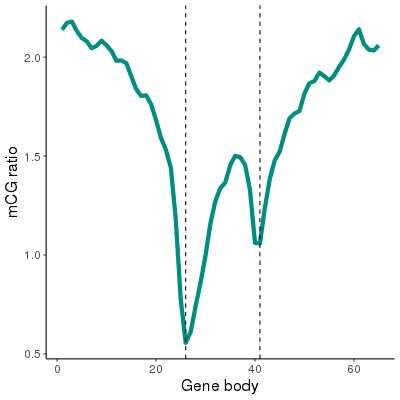

<!--
 * @Descripttion: 
 * @version: 
 * @Author: zpliu
 * @Date: 2024-01-05 22:21:43
 * @LastEditors: zpliu
 * @LastEditTime: 2024-01-07 12:44:15
 * @@param: 
-->
# Distribution of feature along genes

> 该snakemake流程主要是封装了一系列的AWK和Bedtools操作，用于对Gene body区域进化窗口划分.
>
> 通过将划分好的窗口与任意特征所在的窗口取交集，就可以绘制特征在基因周围的分布图

**例如常见的一些特征**：

+ 基因甲基化程度CG、CHG和CHH
+ DHS染色质开发窗口
+ eQTL 区间
+ 等等


### Install

该pipline基于snakemake v7.25.0以及Bedtools实现，因此运行该pipline时，需要将Bedtools加入到当前环境变量中。
> 由于该pipline在每个rule中没有加入resource和threads等设置信息，如果脚本出错很有可能是内存不足的原因，可以手动的在每个rule中对相应的内容进行指定


### 配置文件

`config/config.yaml` 文件是包含以下配置信息; 关于该流程的测试数据可以查看`test` 目录

+ `geneBed`: 基因的Bed文件
+ `Chrlength`: 染色体长度文件，为Samtools faidx输出结果
+ `outPutPrefix`: 输出文件前缀，输出的主要是gene侧翼和body区域划分好的窗口
+ `params`: 划分窗口的参数设置
    + `geneWindowCount` : gene body区域划分为多少个窗口
    + `flankLength`: 选取多少长度范围的侧翼序列
    + `flankWindowCount` 对应的侧翼序列划分为多少个窗口


### Run

将指定基因及其周围序列划分为对应的Bed文件, 划分后的结果文件在`config/config.yaml`中进行了指定。
```bash
#TODO 运行整个流程
cd GWD
snakemake  --cores all

```
将划分好的窗口文件与甲基化特征取交集

```bash
#TODO 获得CG甲基化在Gene body区域的分布
zcat test/CG.txt.gz |intersectBed -a results/test_windows_Id.bed  -b - -loj  |gzip  >results/test.CG.txt.gz 
```

### visualization
> 可视化脚本在`plot.ipynb`中


